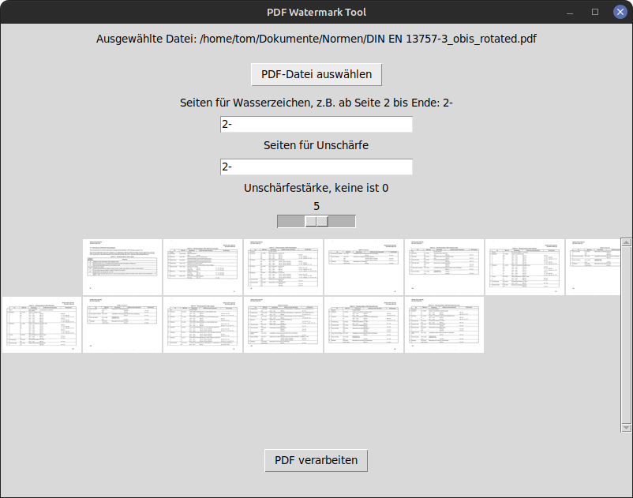

# pdf2blur
## A PDF Watermark Tool

A graphical tool built with Python's Tkinter and PIL libraries for adding watermarks and blurring specific pages in a PDF file. This application enables users to select pages for watermarking and blurring, apply different watermarks in a pattern, and save the processed images with an easy-to-use interface.

## Features

- Drag-and-drop PDF selection or standard file selection dialog
- Supports portrait and landscape format pages
- Thumbnail previews of each page
- Select specific pages for watermarking or blurring
- Adjustable blur strength with a slider
- Custom watermark pattern with alternating watermarks
- Save processed images in a specified folder
- Option to open output folder after processing



## Installation

### Prerequisites
- Python 3.x installed on your machine

### Dependencies
All necessary Python packages can be installed via pip. Run the following command to install required packages:

```bash
pip install -r requirements.txt
```

### Usage

1. Start the application:
   ```bash
   python pdf_watermark_tool.py
   ```
   
2. Drag and drop a PDF into the window or use the "PDF-Datei auswählen" button to choose a file.

3. Select pages for watermarking and blurring:
   - Enter page numbers for watermarking in the format `1,3,7-` (to watermark page 1 and 3 and from page 7 onward).
   - Adjust the blur strength with the slider.

4. Click **PDF verarbeiten** to process the PDF. Once done, a success dialog will appear with options to:
   - **OK**: Close the dialog
   - **Ordner öffnen**: Open the output folder in the file explorer

## Requirements

- See `requirements.txt` for a list of dependencies.

## License

This project is licensed under the GNU General Public License v3.0. Any software that includes or modifies this code must also be made open source under the terms of the GPL. See the [LICENSE](LICENSE) file for the full license text.
